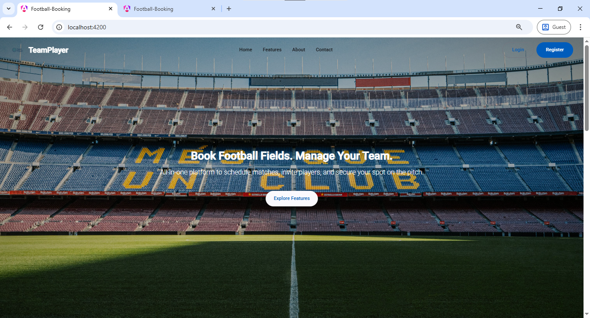
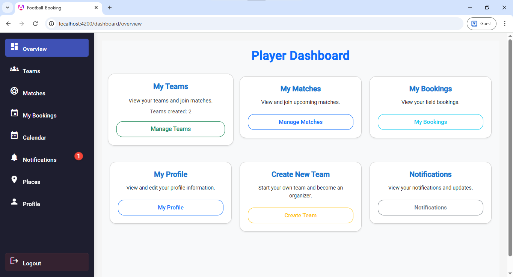
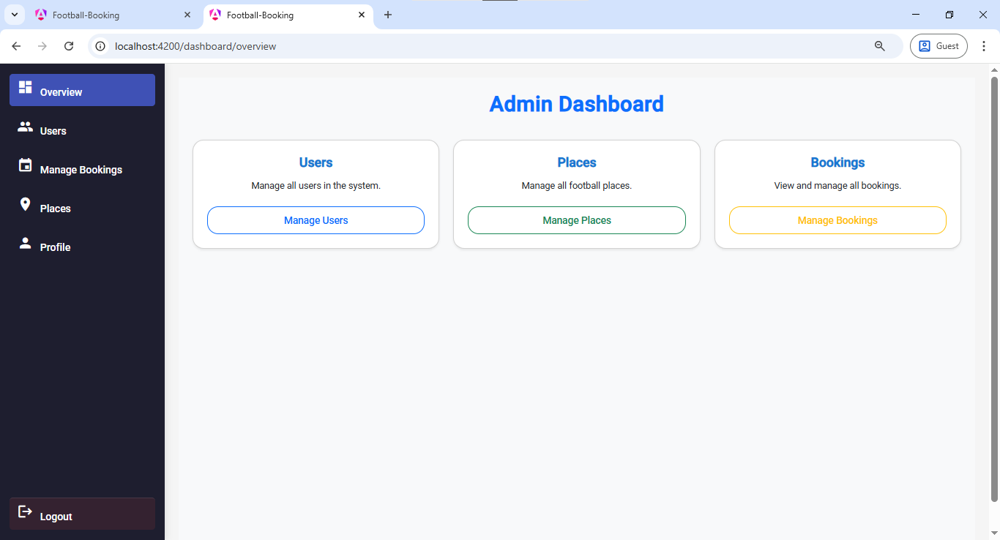
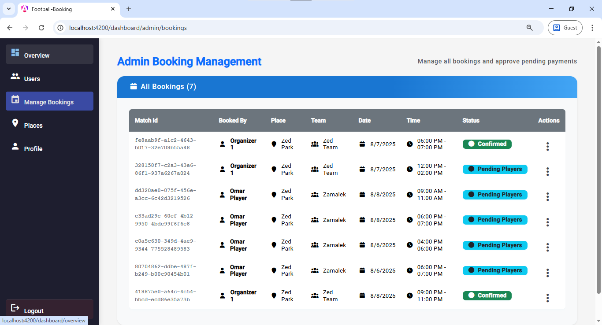
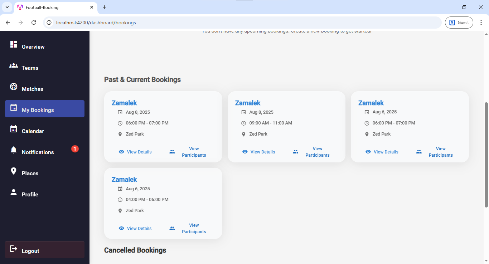
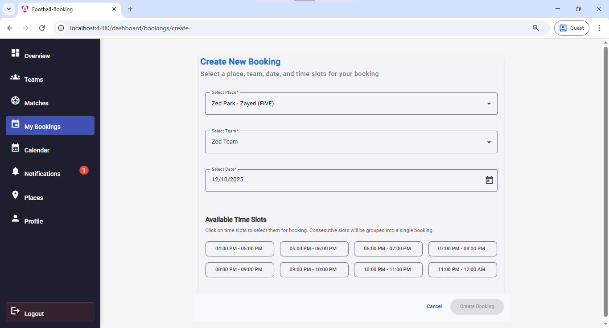
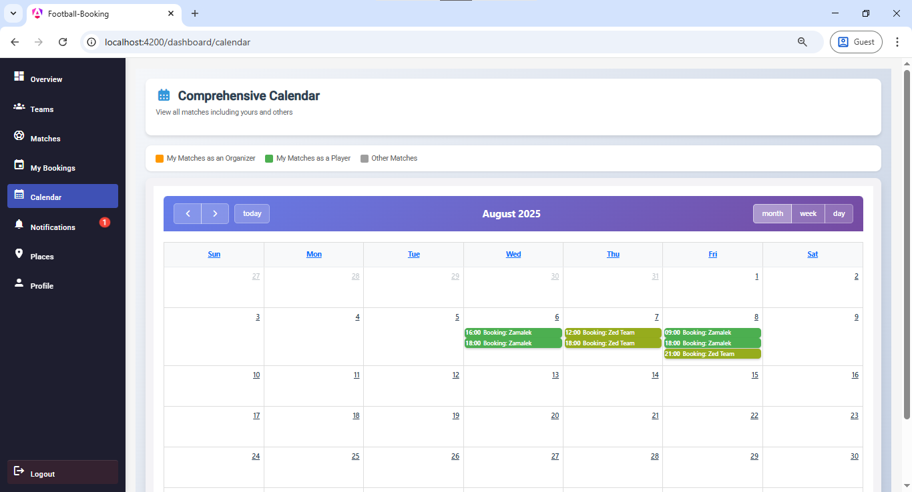
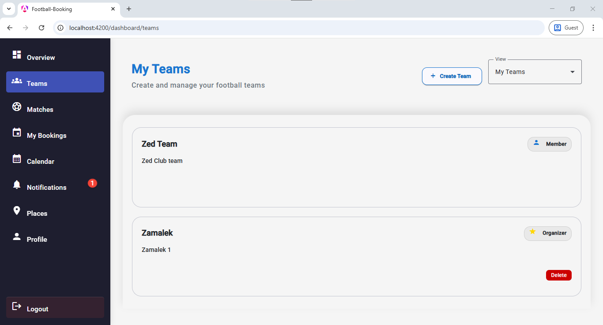
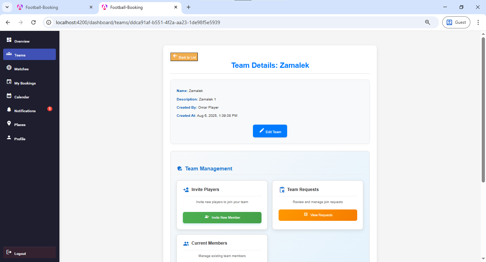

# ⚽ Football Places Booking System

<div align="center">

A comprehensive web application for managing football bookings, teams, and matches with real-time notifications and administrative controls.

[](https://angular.io/)
[](https://www.typescriptlang.org/)
[](https://material.angular.io/)

</div>

---

## 📑 Table of Contents

- [Introduction](#introduction)
- [Project Features](#project-features)
- [Technology Stack](#technology-stack)
- [Quick Preview](#quick-preview)
- [Installation](#installation)
- [Usage](#usage)
- [API Integration](#api-integration)
- [Project Structure](#project-structure)


---

## Introduction

The **Football Places Booking System** is a modern, full-featured web application designed to streamline the process of booking football fields and managing teams. Built with Angular 20 and Material Design, this application provides an intuitive interface for users to:

- Browse and book available football fields
- Create and manage teams
- Organize matches with team members
- Receive real-time notifications for bookings and team activities
- Access comprehensive admin controls for system management

The system supports multiple user roles (Admin, Manager, Player) with different levels of access and functionality, ensuring secure and efficient management of football field bookings.

---

##  Project Features

### 🏟️ Place Management
- **Browse Football Fields**: View available football fields with detailed information including capacity, and location
- **Real-time Availability**: Check field availability in real-time with interactive calendar views
- **Place Types**: Support for different types of fields (5-a-side, 7-a-side, 11-a-side)
- **Admin Controls**: Full CRUD operations for managing football places (Admin only)

### 📅 Booking System
- **Smart Booking**: Book time slots with conflict detection and validation
- **Booking Management**: View, modify, and cancel bookings within policy guidelines
- **Team Integration**: Link bookings with team members for organized matches
- **Participant Invitations**: Invite team members to upcoming matches
- **Booking History**: Track all past and upcoming bookings in the user dashboard

### 👥 Team Management
- **Create Teams**: Form football teams with customizable names and details
- **Team Invitations**: Invite players to join your team with request management
- **Team Requests**: Accept or reject team join requests
- **Team Details**: View comprehensive team information and member lists

### 🔔 Notifications
- **Real-time Updates**: WebSocket-based real-time notifications for instant updates
- **Notification Types**: Booking confirmations, team invitations, match reminders, and more
- **Notification Center**: Centralized notification management with read/unread status
- **Email Integration**: Automated email notifications for important events

### 👤 User Management
- **Authentication**: Secure JWT-based authentication system
- **User Roles**: Support for Admin, Manager, and Player roles
- **Profile Management**: Update user profiles and preferences
- **Admin Dashboard**: Comprehensive user management for administrators

### 📊 Dashboard
- **Overview Statistics**: Visual representation of bookings, teams, and user activity
- **Calendar Integration**: FullCalendar integration for scheduling and booking visualization
- **Quick Actions**: Easy access to frequently used features
- **Role-based Views**: Customized dashboard based on user roles

---

##  Technology Stack

### Frontend Framework
- **Angular 20.0.0**: Latest Angular framework for building dynamic web applications
- **TypeScript**: Strongly-typed programming language for enhanced code quality
- **RxJS 7.8.0**: Reactive programming with observables

### UI Libraries
- **Angular Material 20.1.2**: Material Design components for Angular
- **Angular CDK 20.1.2**: Component Development Kit for custom components
- **Bootstrap 5.3.7**: Responsive grid system and utilities
- **FontAwesome 7.0.0**: Icon library for rich visual elements

### Calendar & Scheduling
- **FullCalendar 6.1.18**: Interactive calendar for booking management
- **FullCalendar Angular**: Angular integration for FullCalendar

### Real-time Communication
- **STOMP.js 7.1.1**: STOMP protocol client for WebSocket communication
- **SockJS Client 1.6.1**: WebSocket polyfill for real-time updates

### Development Tools
- **Angular CLI 20.0.5**: Command-line interface for Angular development
- **Vite**: Fast build tool and development server
- **Prettier**: Code formatter for consistent code style
- **TypeScript Compiler**: Type checking and compilation

### Deployment
- **Docker**: Containerization for easy deployment
- **Docker Compose**: Multi-container orchestration
- **Nginx**: Production web server (configured in Docker)

---

##  Quick Preview

### Home Page


### Dashboard Overview


*Comprehensive dashboard with statistics and quick actions*

### Match Booking




*Interactive calendar for booking football fields*

### Team Management


*Manage teams, members, and team activities*

---

##  Installation

### Prerequisites

Before you begin, ensure you have the following installed:
- **Node.js** (v18 or higher)
- **npm** (v9 or higher) or **yarn**
- **Angular CLI** (v20 or higher)
- **Git**

### Clone the Repository

### Install Dependencies

```bash
npm install
# or
yarn install
```

### Environment Configuration

1. Create a `proxy.conf.json` file if not exists (already configured):
```json
{
  "/api": {
    "target": "http://localhost:8080",
    "secure": false,
    "changeOrigin": true
  }
}
```

2. Update API endpoints in services if needed

### Development Server

Start the development server:

```bash
npm start
# or
ng serve --proxy-config proxy.conf.json
```

Navigate to `http://localhost:4200/` in your browser. The application will automatically reload when you change any source files.

---

##  Usage

### Building for Production

To build the project for production:

```bash
npm run build
# or
ng build
```

The build artifacts will be stored in the `dist/` directory, optimized for production deployment.

### Running Tests

Execute unit tests:

```bash
npm test
# or
ng test
```

### Docker Deployment

Build and run using Docker:

```bash
# Build the Docker image
docker build -t football-booking-ui .

# Run with Docker Compose
docker-compose up -d
```

The application will be available at `http://localhost:80`

### Code Scaffolding

Generate new components:

```bash
ng generate component component-name
ng generate service service-name
ng generate guard guard-name
```

---

##  API Integration

This frontend application integrates with a Spring Boot backend API. The main API endpoints include:

### Authentication
- `POST /api/auth/login` - User login
- `POST /api/auth/register` - User registration
- `POST /api/auth/refresh` - Refresh JWT token

### Users
- `GET /api/users` - Get all users (Admin)
- `GET /api/users/{id}` - Get user by ID
- `PUT /api/users/{id}` - Update user
- `DELETE /api/users/{id}` - Delete user (Admin)

### Places
- `GET /api/places` - Get all places
- `GET /api/places/{id}` - Get place by ID
- `POST /api/places` - Create place (Admin)
- `PUT /api/places/{id}` - Update place (Admin)
- `DELETE /api/places/{id}` - Delete place (Admin)

### Bookings
- `GET /api/bookings` - Get user bookings
- `GET /api/bookings/{id}` - Get booking details
- `POST /api/bookings` - Create booking
- `PUT /api/bookings/{id}` - Update booking
- `DELETE /api/bookings/{id}` - Cancel booking

### Teams
- `GET /api/teams` - Get all teams
- `GET /api/teams/{id}` - Get team details
- `POST /api/teams` - Create team
- `PUT /api/teams/{id}` - Update team
- `DELETE /api/teams/{id}` - Delete team

### Notifications
- `GET /api/notifications` - Get user notifications
- `PUT /api/notifications/{id}/read` - Mark as read
- `WebSocket /ws` - Real-time notifications

**Note**: Update the `proxy.conf.json` file with your backend API URL.

---

##  Project Structure

```
Football-Places-Booking-System-UI/Frontend/
├── src/
│   ├── app/
│   │   ├── core/                          # Core functionality
│   │   │   ├── enums/                     # Enumerations
│   │   │   │   ├── place-type.enum.ts     # Place type definitions
│   │   │   │   └── user-role.ts           # User role definitions
│   │   │   ├── guards/                    # Route guards
│   │   │   │   └── auth-guard.ts          # Authentication guard
│   │   │   ├── interceptors/              # HTTP interceptors
│   │   │   │   ├── auth.interceptor.ts    # Auth header injection
│   │   │   │   ├── error.interceptor.ts   # Error handling
│   │   │   │   └── token-interceptor.ts   # JWT token management
│   │   │   ├── models/                    # Data models
│   │   │   │   ├── iuser.model.ts         # User interface
│   │   │   │   ├── iplace.model.ts        # Place interface
│   │   │   │   ├── iteam-member.model.ts  # Team member interface
│   │   │   │   └── ierror-code.model.ts   # Error code interface
│   │   │   ├── services/                  # Core services
│   │   │   │   ├── auth.service.ts        # Authentication
│   │   │   │   ├── user.service.ts        # User management
│   │   │   │   ├── place.service.ts       # Place management
│   │   │   │   ├── booking.service.ts     # Booking operations
│   │   │   │   ├── team.service.ts        # Team management
│   │   │   │   ├── team-member.service.ts # Team member operations
│   │   │   │   ├── notification.service.ts # Notifications
│   │   │   │   ├── websocket.service.ts   # WebSocket connection
│   │   │   │   ├── error-handler.service.ts # Error handling
│   │   │   │   └── error-mapping.service.ts # Error mapping
│   │   │   └── utils/                     # Utility functions
│   │   │       ├── error-utils.ts         # Error utilities
│   │   │       └── utils.ts               # General utilities
│   │   │
│   │   ├── features/                      # Feature modules
│   │   │   ├── auth/                      # Authentication
│   │   │   │   ├── login/                 # Login component
│   │   │   │   └── register/              # Registration component
│   │   │   ├── dashboard/                 # Dashboard
│   │   │   │   ├── dashboard-layout/      # Dashboard layout
│   │   │   │   ├── overview-page/         # Overview page
│   │   │   │   └── admin-dashboard/       # Admin dashboard
│   │   │   ├── bookings/                  # Booking management
│   │   │   │   ├── booking-list/          # List bookings
│   │   │   │   ├── booking-form/          # Create booking
│   │   │   │   ├── booking-details/       # Booking details
│   │   │   │   ├── invite-participants/   # Invite to match
│   │   │   │   └── admin-booking-management/ # Admin controls
│   │   │   ├── places/                    # Place management
│   │   │   │   └── place-list/            # List places
│   │   │   ├── teams/                     # Team management
│   │   │   │   ├── team-list/             # List teams
│   │   │   │   ├── team-details/          # Team details
│   │   │   │   ├── create-team/           # Create team
│   │   │   │   ├── team-requests/         # Join requests
│   │   │   │   └── invite-player/         # Invite players
│   │   │   ├── matches/                   # Match management
│   │   │   ├── notifications/             # Notification center
│   │   │   └── users/                     # User management
│   │   │       └── user-list/             # List users (Admin)
│   │   │
│   │   ├── home/                          # Landing page
│   │   │   ├── home-page/                 # Main home page
│   │   │   ├── home-navbar/               # Navigation bar
│   │   │   ├── hero-section/              # Hero section
│   │   │   ├── features-section/          # Features showcase
│   │   │   ├── about-section/             # About section
│   │   │   ├── contact-section/           # Contact section
│   │   │   └── home-footer/               # Footer
│   │   │
│   │   ├── shared/                        # Shared components
│   │   │   ├── sidebar/                   # Navigation sidebar
│   │   │   ├── confirmation-dialog/       # Confirmation dialogs
│   │   │   ├── error-notifications/       # Error display
│   │   │   ├── error-demo/                # Error testing
│   │   │   └── not-found/                 # 404 page
│   │   │
│   │   ├── app.config.ts                  # App configuration
│   │   ├── app.routes.ts                  # Route definitions
│   │   └── app.ts                         # Root component
│   │
│   ├── index.html                         # Main HTML file
│   ├── main.ts                            # Bootstrap file
│   ├── styles.css                         # Global styles
│   └── custom-theme.scss                  # Material theme
│
├── public/                                # Static assets
│   ├── logo.png                           # Application logo
│   ├── field.png                          # Field icons
│   └── [other images]                     # Images & icons
│
├── .angular/                              # Angular cache
├── .vscode/                               # VS Code settings
├── angular.json                           # Angular configuration
├── package.json                           # Dependencies
├── tsconfig.json                          # TypeScript config
├── docker-compose.yml                     # Docker compose
├── Dockerfile                             # Docker image
├── proxy.conf.json                        # Proxy configuration
└── README.md                              # This file
```

